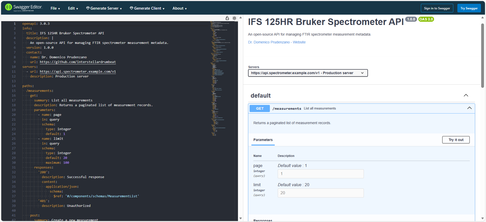

# IFS 125HR Bruker Spectrometer API

An open-source API for managing FTIR spectrometer measurement metadata.  

**Status:** Beta | **License:** MIT | **Version:** 1.0.0

> **Note:** This project uses "Bruker" and "IFS 125HR" as examples of real-world instrument naming conventions. This is not an official Bruker product or documentation.

## Overview

This project defines a standardized JSON schema for Fourier-Transform Infrared (FTIR) spectrometer data and provides a RESTful API specification for managing these records. It is designed to help researchers and developers integrate spectrometer data into automated pipelines and analysis tools.

### Key Features

- **Standardized Schema:** Validated against JSON Schema Draft 2020-12.
- **RESTful API:** Full OpenAPI 3.0 specification included.
- **Scientific Approach:** Supports typical FTIR parameters (apodization, wavenumber ranges).
- **Open Source:** Free to use, modify, and contribute to.

## Project Structure

| File | Description |
| :--- | :--- |
| `measurement_schema.json` | The core JSON Schema for validation. |
| `measurement_example.json` | A valid example data file. |
| `openapi.yaml` | The OpenAPI 3.0 specification for the API. |
| `docs/` | Documentation and guides. See the [Documentation](#documentation) section below for more details. |

## Quick Start

### 1. Validate Data Locally

You can validate the JSON file against the schema using standard JSON Schema validators.

Example using `ajv-cli`:
```
npm install -g ajv-cli
ajv validate -s measurement_schema.json -d measurement_example.json
```
If the JSON file conforms to the schema, you will see `measurement_example.json valid`.

>NOTE: Requires [Node.js](https://nodejs.org). Works on Linux, macOS, and Windows.

### 2. Explore the API

The API specification is defined in `openapi.yaml`. You can visualize it instantly as follows:

1. Open [Swagger Editor](https://editor.swagger.io/)
2. Paste the contents of `openapi.yaml` on the left panel
3. Click "Try it out" on the right panel to simulate requests (e.g. for get/measurements).


**Here is what the rendered documentation looks like:**

_Left: OpenAPI 3.0 specification (source code) | Right: Rendered interactive API reference with "Try it out" functionality_

### 3. Python Integration

Here an example of how you can interact with the API using Python:
```
import requests

BASE_URL = "https://api.spectrometer.example.com/v1"
TOKEN = "your_bearer_token"

def create_measurement(data):
    """Submit a new measurement"""
    headers = {
      "Authorization": f"Bearer {TOKEN}",
      "Content-Type": "application/json"
    }
    response = requests.post(f"{BASE_URL}/measurements", json=data, headers=headers)
    return response.json()

result = create_measurement(my_data)
```

**See the full SDK with error handling in the [Python SDK Guide](docs/python-sdk-example.md).**

## Documentation

For detailed guides and reference material, explore the documentation folder:

### API Interaction
- **[API Reference](docs/api-reference.md)**: Endpoints, authentication, and request/response examples.
- **[Getting Started](docs/getting-started.md)**: How to set up and validate data locally.
- **[Python SDK Guide](docs/python-sdk-example.md)**: Complete code samples for integration.

### Data Structure
- **[Schema Reference](docs/schema_documentation.md)**: Detailed explanation of every field and data type.
- **[Schema Diagram](docs/schema_diagram.md)**: Visual overview of the data hierarchy.
- **[Validation Guide](docs/validation-guide.md)**: Instructions for using `ajv-cli`.

## Contributing

This is an open-source project. We welcome contributions!

1. Fork the repo.
2. Create a feature branch.
3. Submit a Pull Request.

## License

MIT License.
